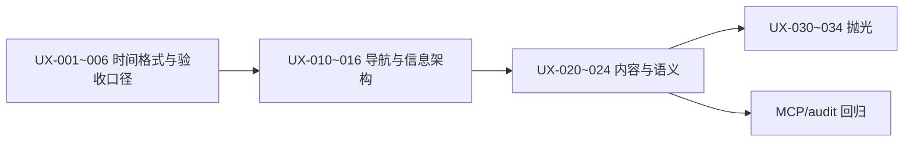

# Dashboard UI/UX 审查问题核实与优化方案

**关联文档**：[mcp-dashboard-uiux-review-2026-05-18.md](./mcp-dashboard-uiux-review-2026-05-18.md)  
**核实日期**：2026-05-19  
**核实方式**：对照当前 `main` 分支源码（`src/dashboard/`）与 MCP 快照现象逐项核对，非仅复述审查结论。

---

## 1. 核实结论总表

| 结论标记     | 含义                                       |
| -------- | ---------------------------------------- |
| **属实**   | 代码或运行时可稳定复现，建议纳入改造                       |
| **部分属实** | 现象存在，但根因混合（数据缺失 / Streamlit 框架 / 仅辅助技术树） |
| **框架限制** | 主要由 Streamlit/Material 组件决定，应用层只能缓解      |
| **待复测**  | 审查时成立，需浏览器或数据更新后再确认                      |

---

## 2. 全局问题核实

| ID  | 审查结论                        | 核实         | 代码/根因依据                                                                                                                                                                                                         |
| --- | --------------------------- | ---------- | --------------------------------------------------------------------------------------------------------------------------------------------------------------------------------------------------------------- |
| G-1 | 侧栏首页显示「app」                 | **属实**     | 入口为 `src/dashboard/app.py`，Streamlit multipage 默认用文件名作导航标签；未配置 `pages/` 下 `01_总览.py` 等别名                                                                                                                        |
| G-2 | 双重导航 + 工作流展示 `pages/xx.py`  | **属实**     | `components.render_sidebar_chrome()` 渲染工作流；`render_workflow_nav()` / `render_workflow_quick_links()` 使用 `st.caption(f"{label} · {path}")`（`components.py` L41-42、L51-54）                                        |
| G-3 | 折叠控件含 `keyboard_arrow_down` | **框架限制**   | `st.expander` 由 Streamlit 生成，应用未自定义 `aria-label`                                                                                                                                                                |
| G-4 | 📊 与 Main menu 英文混排         | **部分属实**   | 品牌区为自定义 HTML（`components.py` L19-28）；Main menu 为 Streamlit 内置                                                                                                                                                   |
| G-5 | KPI 日期时间被拆成多段               | **属实**     | `render_data_status_bar()` 将 `latest_date.max()` 直接传入 `st.metric`（`components.py` L114-118）；Series 常被推断为 `datetime64`，Streamlit 按时分秒拆 DOM。产业链 `st.caption(...{snapshot['generated_at']})`（`05_产业链研究.py` L221）同理 |
| G-6 | DataGrid/Canvas 表格 a11y 弱   | **框架限制**   | 全站 `st.dataframe`；侧栏任务表已选列但仍依赖框架（`data_refresh.py` L812-813）                                                                                                                                                    |
| G-7 | 总览无 console 报错              | **属实（当时）** | 非缺陷；建议在关键交互后复测                                                                                                                                                                                                  |

---

## 3. 分页面问题核实

### 3.1 总览

| ID  | 核实       | 说明                                                                                                               |
| --- | -------- | ---------------------------------------------------------------------------------------------------------------- |
| H-1 | **部分属实** | `home.py` 对创业板指走 `_load_market_metrics()`；库中无该指数估值时 `_fmt_pct` 返回 `"--"`（非数据缺失时的业务说明）。审查中的「—」为展示/读屏差异，**缺数现象真实** |
| H-2 | **属实**   | 同 G-5，`render_data_status_bar()`                                                                                 |
| H-3 | **属实**   | `render_workflow_quick_links()` 与侧栏 `render_workflow_nav()` 结构重复                                                 |
| H-4 | **部分属实** | 侧栏任务表代码含 6 列（`data_refresh.py` L812）；MCP 仅突出「任务」列属 **dataframe a11y/横向滚动** 问题，非列缺失                               |
| H-5 | **框架限制** | 侧栏收起按钮为 Streamlit 内置，应用未包装                                                                                       |

### 3.2 估值与市场

| ID  | 核实         | 说明                                                                                                         |
| --- | ---------- | ---------------------------------------------------------------------------------------------------------- |
| V-1 | **部分属实**   | `最新日期` 来自 `valid["日期"].max()`（`02_估值与市场.py` L148-155）；快照中 `日期` 多为字符串，拆段不如 KPI 明显；**统一格式仍建议做**              |
| V-2 | **部分属实**   | `_fmt()` 对空值统一 `"--"`（L93-99）；`PB`/`PB百分位` 来自 `storage.get_index_valuation()`，**数据源常无 pb 字段**——显示与「未采集」未区分 |
| V-3 | **属实**     | `st.success` / `st.warning` / `st.error` 使用 assertive live region（Streamlit 默认）                            |
| V-4 | **属实（正向）** | Tab 可切换，非缺陷                                                                                                |

### 3.3 策略实验室

| ID  | 核实       | 说明                                                          |
| --- | -------- | ----------------------------------------------------------- |
| S-1 | **属实**   | `st.tabs` 共 **7 个**（`03_策略实验室.py` L185）                     |
| S-2 | **框架限制** | `st.number_input` / `st.slider` 加减按钮无 aria 名称为 Streamlit 行为 |
| S-3 | **部分属实** | 已有 `render_page_help`，可加强分步说明                               |

### 3.4 组合中心

| ID  | 核实         | 说明                                           |
| --- | ---------- | -------------------------------------------- |
| P-1 | **属实**     | `px.pie(..., names="名称")`（L164），长名称在图例截断     |
| P-2 | **部分属实**   | 列名为「最新价格」，格式 `¥x.xxx`（L159-160），与「目标金额」并列易混淆 |
| P-3 | **属实（正向）** | 权重总和提示存在                                     |

### 3.5 产业链研究

| ID  | 核实       | 说明                                     |
| --- | -------- | -------------------------------------- |
| I-1 | **属实**   | `generated_at` 直接写入 `st.caption`（L221） |
| I-2 | **待复测**  | 筛选区 `heading` 在侧栏/主区 DOM 顺序需实机再看；非逻辑错误 |
| I-3 | **属实**   | 多 Tab + 多 expandable + 多表，页面很长         |
| I-4 | **部分属实** | 已有文案引导补采；**无跳转按钮**（审查建议合理）             |

### 3.6 资讯事件

| ID  | 核实       | 说明                                                                                                                                                    |
| --- | -------- | ----------------------------------------------------------------------------------------------------------------------------------------------------- |
| N-1 | **部分属实** | `_load_news` 已将时间 `str()`（L83）；列表用 `st.caption(" | ".join(meta_parts))`（L188）。拆段更可能来自 **Streamlit 对含冒号长文本的渲染**，仍建议格式化为 `YYYY-MM-DD HH:mm` 单段 markdown |
| N-2 | **部分属实** | 代码仅一处 `st.markdown(**标题**)`（L176）；快照重复可能含 **容器边框/截断预览** 重复节点，建议实机确认后合并展示                                                                              |
| N-3 | **部分属实** | 已 `filtered.head(30)`（L272），**非全量**；但 30 条卡片仍偏长，分页可继续优化                                                                                               |
| N-4 | **部分属实** | 与 N-2 同源，长标题展示策略可统一                                                                                                                                   |

### 3.7 报告中心

| ID  | 核实       | 说明                                                                                |
| --- | -------- | --------------------------------------------------------------------------------- |
| R-1 | **属实**   | 复用 `render_data_status_bar()`                                                     |
| R-2 | **部分属实** | 仅 `date_input("报告日期")` 单日期（L130）；「请选择第二日期」为 **Streamlit date_input 内置辅助技术文案**，易误导 |
| R-3 | **属实**   | `近日报告素材` 实际为 `stats["news_count"]`（L120），无单位说明                                    |
| R-4 | **属实**   | `失败更新` 来自 `update_runs` 统计（L77、L122），**无跳转**至数据管理/更新日志                            |

### 3.8 数据管理

| ID  | 核实         | 说明                                               |
| --- | ---------- | ------------------------------------------------ |
| D-1 | **框架限制**   | 同 S-2，`spinbutton` 为 Streamlit                   |
| D-2 | **部分属实**   | 按钮已按「基础市场 / 资讯与海外 / 产业链」分块（`08_数据管理.py`），可再按风险分级 |
| D-3 | **属实（正向）** | 页首队列说明清晰                                         |

---

## 4. 优化方案（按主题）

### 4.0 实施前提与边界

1. **先固定/记录 Streamlit 版本，再做导航架构调整**：当前依赖为 `streamlit>=1.40.0`，导航、DataGrid、Tabs、number_input 的 DOM/a11y 行为会随版本变化。涉及 `st.navigation`、隐藏默认 multipage、首页入口迁移前，必须先确认本地与部署环境版本，并跑全页面浏览器巡检。
2. **短期不重新引入 `st.page_link`**：既有巡检记录显示 `st.page_link` 在当前运行环境兼容性不稳定。本轮导航优化优先做“去源码路径、保留业务名称、减少重复入口”；可点击跳转应使用当前 multipage 默认入口或稳定 markdown 链接，待版本固定后再评估 `st.navigation`/`st.page_link`。
3. **区分应用缺陷与 Streamlit 框架限制**：G-3、G-6、H-5、S-2、D-1 等主要由 Streamlit 内置组件生成，应用层只做摘要、说明、版本升级评估，不为修 aria 重写基础控件。
4. **MCP/a11y 快照需区分可见 UI 与隐藏 DOM**：Streamlit tabs/expanders 可能把隐藏内容保留在辅助技术树中。验收时同时检查页面可见内容、文本快照、控制台错误和用户路径，不能只按单次 a11y 树节点判定。
5. **已完成项只做复测，不重复施工**：`gatherUsageStats=false`、`layout="wide"`、`initial_sidebar_state="auto"`、浏览器巡检脚本与 404 console 噪声过滤等已存在，后续只纳入回归验证。

---

### 4.1 时间展示统一（P0，应用层可修）

**目标**：所有 KPI / caption / metric 中的日期时间以**单一字符串**输出。

**方案**：

1. 在 `components.py` 新增 `format_display_datetime(value) -> str`，规则：`YYYY-MM-DD HH:mm`（业务日仅 `YYYY-MM-DD`）。
2. `render_data_status_bar`：`latest_date.max()` 先 `format_display_datetime` 再传入 `render_metric_cards`。
3. `02_估值与市场.py`：`最新日期` 指标、`日期` 列展示统一格式化。
4. `05_产业链研究.py`：`generated_at`、`latest_market_date` 等经 formatter。
5. `06_资讯事件.py`：`_load_news` 中 `时间` 字段格式化；`_render_news_cards` 的 meta 用 `st.markdown` 单行而非易拆段的 caption（可选）。

**测试补充**：formatter 覆盖 `datetime`、`date`、`pd.Timestamp`、ISO 字符串、`NaT`、`None`、空字符串、已格式化字符串、带毫秒时间。

**验收**：Chrome a11y 快照中同一时刻不再出现 `:23`、`.048562` 等孤立节点；可见 UI 中日期时间口径统一，业务日不带无意义 `00:00:00`。

---

### 4.2 导航与信息架构（P1）

**目标**：用户只见业务名称，不见源码路径；减少重复入口。

**方案**：

1. **短期低风险修复**：`render_workflow_nav` / `render_workflow_quick_links` 仅显示业务 `label`，删除 `· pages/xx.py`，不引入 `st.page_link`。
2. **首页命名评估**：不要直接把 `app.py` 移到 `pages/01_总览.py`。先评估 `st.navigation` 单入口、默认 multipage 入口、巡检脚本、部署命令和深链路由影响。
3. **总览工作流入口**：保留卡片式快捷入口，侧栏仅导航；或侧栏导航 + 总览仅保留「常用 3 步」文案。
4. **中期导航架构**：Streamlit 版本固定并通过全页面巡检后，再选择 `st.navigation` 或自定义稳定链接；如需隐藏默认 multipage 列表，必须有回滚方案。

**验收**：侧栏无「app」、无 `.py` 路径；总览与侧栏职责清晰。

---

### 4.3 数据语义与缺数提示（P1–P2）

| 场景        | 方案                                                     |
| --------- | ------------------------------------------------------ |
| 创业板指等缺估值  | KPI 显示「暂无」+ 文案指向数据管理「更新指数估值」；短期不依赖 `st.page_link` |
| PB 为 `--` | 列级区分：`暂无`（未采集）/ `—`（不适用）；tooltip 说明                    |
| 产业链指数估值暂无 | `I-4`：增加稳定入口说明或 markdown 链接到数据管理；版本固定后再评估原生跳转 |
| 报告中心失败更新  | `R-4`：告警旁提供数据管理/更新日志定位说明；如实现深链，需先验证路由兼容性 |

---

### 4.4 资讯与长列表（P2）

1. 新闻卡片：标题一行；meta 一行（已格式化时间）；摘要独立且样式弱化。
2. 默认 `head(30)` 改为分页：`st.number_input` 页码或「加载更多」。
3. 去重：避免标题在 accessible name 中出现两次（合并为一个 markdown 块）。

---

### 4.5 可访问性与框架边界（P2–P3）

| 项               | 可做                                          | 不可做（仅缓解）             |
| --------------- | ------------------------------------------- | -------------------- |
| 侧栏收起按钮          | 自定义侧栏 + 隐藏默认（成本高）                           | 改 Streamlit 按钮文案     |
| number_input 加减 | 用 `st.text_input` + 校验替代（降级体验）              | 改 Streamlit 内部 aria  |
| DataGrid        | 关键表增加页顶摘要 metrics                           | 完全等同 HTML table a11y |
| 市场温度 alert      | 首屏后用 `st.info` 替代 `st.success` 或静态 markdown | 去掉 live region       |

---

### 4.6 策略/组合体验抛光（P3）

- 策略实验室：7 Tab → 二级「信号工具 | 回测中心」分组。
- 组合中心：饼图 `names` 用 `代码` 或 `代码+简称`；列名「最新收盘价（元）」。
- 数据管理：低频/全量补采按钮增加 `st.confirm` 或二次确认。

---

## 5. TodoList

### P0 — 本周（低成本、高收益）

- [x] **UX-001** 新增 `format_display_datetime()`，并用于 `render_data_status_bar`（修 G-5、H-2、R-1）
- [x] **UX-002** 估值与市场「最新日期」指标格式化（V-1）
- [x] **UX-003** 产业链 `generated_at` / 行情财报日期格式化（I-1）
- [x] **UX-004** 资讯列表时间字段与 meta 行统一格式（N-1）
- [x] **UX-005** 为上述改动补充 `tests/test_dashboard/test_formatting.py`
- [x] **UX-006** 更新 MCP/a11y 验收口径：区分可见 UI、隐藏 DOM、控制台错误与用户路径（见 §4.0）

### P1 — 下一迭代（导航与专业感）

- [x] **UX-010** 记录推荐验证环境：`.venv2` / Python 3.12 / Streamlit 1.57.0 / DuckDB 1.5.2；导航架构调整前跑全页面浏览器巡检
- [x] **UX-011** `render_workflow_nav` / `render_workflow_quick_links` 去掉 `.py` 路径；短期不引入 `st.page_link`（G-2）
- [x] **UX-012** 总览与侧栏工作流入口去重（H-3）
- [x] **UX-013** 总览创业板指等缺数：文案 + 指向数据管理（H-1）
- [x] **UX-014** 侧栏后台任务：表格外增加「运行中 N / 失败 M」摘要（H-4）
- [x] **UX-015** 报告中心「失败更新」增加数据管理定位说明（R-4）
- [x] **UX-016** 首页「app」命名改造：`st.navigation` 单入口 + `pages/01_总览.py`；见 [dashboard-navigation-migration.md](./dashboard-navigation-migration.md)（G-1）

### P2 — 体验与内容

- [x] **UX-020** 估值表 PB/PB百分位：区分未采集（显示「暂无」）（V-2）
- [x] **UX-021** 资讯卡片去重标题展示 + 分页（N-2、N-3、N-4）
- [x] **UX-022** 报告参数：单日期场景说明文案；指标改为「近200条新闻素材」等（R-2、R-3）
- [x] **UX-023** 产业链指数估值区增加「去数据管理」markdown 链接（I-4）
- [x] **UX-024** 浏览器巡检接入验收命令与文档记录；上次成功巡检覆盖 8 页，无 `stException` / 业务 bad 文本。本轮提交前在当前 Windows 会话复跑时被 Playwright 子进程权限阻断，需按下方命令在正常交互终端补跑。

### P3 — 抛光

- [x] **UX-030** 策略实验室 Tab 分组（S-1）
- [x] **UX-031** 组合中心饼图图例与列名（P-1、P-2）
- [x] **UX-032** 数据管理高风险按钮二次确认（D-2）
- [x] **UX-033** 策略/数据管理「功能说明」补充分步引导（S-3、D-3 增强）
- [x] **UX-034** 评估 Streamlit DataFrame a11y：见 [streamlit-a11y-notes.md](./streamlit-a11y-notes.md)；表前 hint + 侧栏任务摘要（G-6）

### 验收环境与命令

- 推荐环境：`.venv2\Scripts\python.exe`，当前核验版本为 Streamlit 1.57.0、DuckDB 1.5.2。
- 本地基础回归：`powershell -NoProfile -ExecutionPolicy Bypass -File .\scripts\check_all.ps1`（2026-05-19 已通过：Ruff passed，pytest 70 passed）
- 浏览器回归：先启动 `scripts\start_dashboard.ps1 -Port 8501`，再运行 `powershell -NoProfile -ExecutionPolicy Bypass -File .\scripts\check_all.ps1 -BrowserAudit -Port 8501`。若当前 Windows 会话报 `PermissionError: CreateFile`，说明 Playwright/MCP 浏览器子进程被本机权限阻断，应换正常交互终端或重启终端会话后复跑。
- 上次成功浏览器巡检（2026-05-19）：总览/估值与市场/产业链研究/策略实验室/组合中心/资讯事件/报告中心/数据管理 — 全部 `stException=0`，无业务 bad 文本；本轮提交前当前会话复跑 BrowserAudit 被 `PermissionError: CreateFile` 阻断，需在正常交互终端补跑确认。
- 不建议使用全局 Anaconda `python` 作为验收环境；该环境可能缺少 `duckdb`、`ruff`，并触发 `.pytest_cache` / `__pycache__` 权限问题。
- `scripts/check_all.ps1` 已使用仓库内 `tmp_check_all/` 作为临时根，并对 Ruff/pytest/浏览器巡检统一检查退出码，避免命令失败但脚本误报成功。

### 不纳入本期（框架限制，仅观察）

- G-3、G-4、H-5、S-2、D-1：记录为 Streamlit 已知限制，不在本期强行改造；通过版本升级评估和页面级摘要缓解。
- V-3：若改 alert 策略需 UX 评审后再动。

---

## 6. 建议实施顺序（与审查报告对照）

---

## 7. 核实说明

- **32 项审查问题中**：约 **18 项属实或建议在应用层修复**；**10 项部分属实**（需数据、框架或复测配合）；**4 项为框架限制或正向确认**。
- 审查报告中 **P0 时间拆段（G-5）** 与代码 `**render_data_status_bar` + `st.metric`** 完全对应，**建议优先落地 UX-001**。
- 审查报告中 **N-1 标为高**，代码侧已有 `str(时间)`，降级为 **部分属实**，但仍建议按 P0 统一格式化并改渲染方式。

---

*文档维护：完成 UX 条目后请在对应 checkbox 打勾，并在 PR 中引用本文件与 MCP 审查报告。*
